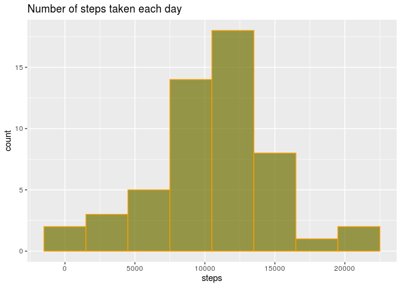
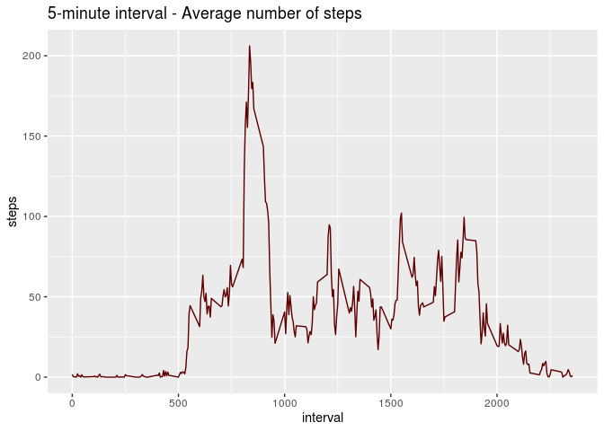
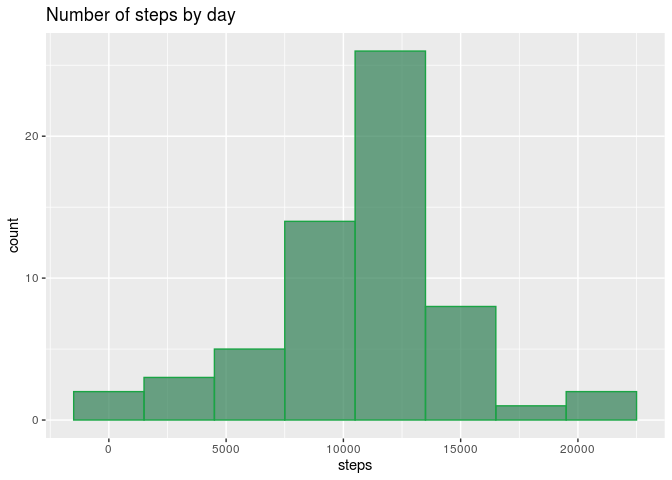
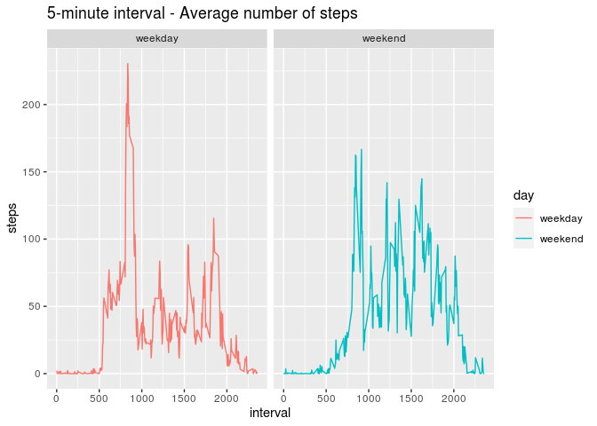

Introduction
------------

It is now possible to collect a large amount of data about personal
movement using activity monitoring devices such as a Fitbit, Nike
Fuelband, or Jawbone Up. These type of devices are part of the
“quantified self” movement – a group of enthusiasts who take
measurements about themselves regularly to improve their health, to find
patterns in their behavior, or because they are tech geeks. But these
data remain under-utilized both because the raw data are hard to obtain
and there is a lack of statistical methods and software for processing
and interpreting the data.

This assignment makes use of data from a personal activity monitoring
device. This device collects data at 5 minute intervals through out the
day. The data consists of two months of data from an anonymous
individual collected during the months of October and November, 2012 and
include the number of steps taken in 5 minute intervals each day.

Load the data (i.e. read.csv())
-------------------------------

Process/transform the data (if necessary) into a format suitable for
your analysis

    library(ggplot2)
    library(dplyr)

    ## 
    ## Attaching package: 'dplyr'

    ## The following objects are masked from 'package:stats':
    ## 
    ##     filter, lag

    ## The following objects are masked from 'package:base':
    ## 
    ##     intersect, setdiff, setequal, union

    activity = read.csv('activity.csv', header = T)
    str(data)

    ## function (..., list = character(), package = NULL, lib.loc = NULL, verbose = getOption("verbose"), 
    ##     envir = .GlobalEnv, overwrite = TRUE)

What is mean total number of steps taken per day?
-------------------------------------------------

For this part of the assignment, you can ignore the missing values in
the dataset.

1.  Calculate the total number of steps taken per day.

<!-- -->

    sum(activity$steps, na.rm = TRUE)

    ## [1] 570608

1.  Make a histogram of the total number of steps taken each day.

<!-- -->

    step_date <- aggregate(steps~date, data=activity, FUN=sum, na.rm=TRUE)
    ggplot(step_date, aes( x = steps )) + 
          geom_histogram(binwidth=3000, fill="#6F7000", color="#FAA000", alpha=0.7) + 
          ggtitle("Number of steps taken each day")

1.  Calculate and report the mean and median of the total number of
    steps taken per day

<!-- -->

    mean(step_date$steps) 

    ## [1] 10766.19

    median(step_date$steps)

    ## [1] 10765

What is the average daily activity pattern?
-------------------------------------------

1.  Make a time series plot of the 5-minute interval (x-axis) and the
    average number of steps taken, averaged across all days (y-axis)

<!-- -->

    mean_interval <- aggregate(steps~interval, data=activity, FUN=mean, na.rm=TRUE)
    ggplot(mean_interval, aes( x = interval, y = steps  )) +
          geom_line(color="#5F0000") +
          ggtitle("5-minute interval - Average number of steps")

 2.
Which 5-minute interval, on average across all the days in the dataset,
contains the maximum number of steps?

    max_step <- max(mean_interval$steps)
    mean_interval$prueba <- ifelse(max_step == mean_interval$steps, 1, NA)
    mean_interval <- mean_interval[!is.na(mean_interval$prueba),]
    mean_interval$interval

    ## [1] 835

Imputing missing values
-----------------------

Note that there are a number of days/intervals where there are missing
values (coded as NA). The presence of missing days may introduce bias
into some calculations or summaries of the data.

1.  Calculate and report the total number of missing values in the
    dataset (i.e. the total number of rows with NAs).

<!-- -->

    activity_na <- activity
    activity_na$na <- ifelse(is.na(activity_na) , 1, 0)
    sum(activity_na$na)

    ## [1] 2304

1.  Devise a strategy for filling in all of the missing values in the
    dataset.

It will use the mean per interval.

1.  Create a new dataset that is equal to the original dataset but with
    the missing data filled in.

<!-- -->

    activity_p <- activity
    mean_interval <- aggregate(steps~interval, data=activity, FUN=mean, na.rm=TRUE)
    for (i in 1:17568){
    if(is.na(activity$steps[i])){
          mean_interval_d <- mean_interval
          mean_interval_d <- filter(mean_interval_d, mean_interval_d$interval == activity$interval[i])
          activity_p$steps[i] <-  mean_interval_d$steps[1]
    }
    }
    head(activity_p)

    ##       steps       date interval
    ## 1 1.7169811 2012-10-01        0
    ## 2 0.3396226 2012-10-01        5
    ## 3 0.1320755 2012-10-01       10
    ## 4 0.1509434 2012-10-01       15
    ## 5 0.0754717 2012-10-01       20
    ## 6 2.0943396 2012-10-01       25

1.  Make a histogram of the total number of steps taken each day

<!-- -->

    step_date_p <- aggregate(steps~date, data=activity_p, FUN=sum)
    ggplot(step_date_p, aes( x = steps )) + 
          geom_histogram(binwidth=3000, fill="#2F7E54", color="#1AA444", alpha=0.7) + 
          ggtitle("Number of steps by day")

Are there differences in activity patterns between weekdays and weekends?
-------------------------------------------------------------------------

1.  Create a new factor variable in the dataset with two levels -
    “weekday” and “weekend” indicating whether a given date is a weekday
    or weekend day.

<!-- -->

    activity_p$day <- weekdays(as.Date(activity_p$date))
    activity_p$week <- ifelse(activity_p$day == "sábado" | activity_p$day == "domingo","weekend","weekday")
    head(activity_p)

    ##       steps       date interval   day    week
    ## 1 1.7169811 2012-10-01        0 lunes weekday
    ## 2 0.3396226 2012-10-01        5 lunes weekday
    ## 3 0.1320755 2012-10-01       10 lunes weekday
    ## 4 0.1509434 2012-10-01       15 lunes weekday
    ## 5 0.0754717 2012-10-01       20 lunes weekday
    ## 6 2.0943396 2012-10-01       25 lunes weekday

1.  Make a panel plot containing a time series plot of the 5-minute
    interval (x-axis) and the average number of steps taken, averaged
    across all weekday days or weekend days (y-axis).

<!-- -->

    activity_p_weekday <- filter(activity_p, week == "weekday")
    activity_p_weekend <- filter(activity_p, week == "weekend")
    mean_interval_p_weekday <- aggregate(steps~interval, data=activity_p_weekday, FUN=mean, na.rm=TRUE)
    mean_interval_p_weekend <- aggregate(steps~interval, data=activity_p_weekend, FUN=mean, na.rm=TRUE)
    mean_interval_p_weekday$day <- "weekday"
    mean_interval_p_weekend$day <- "weekend"
    mean_interval_p_w <- rbind(mean_interval_p_weekday,mean_interval_p_weekend)
    ggplot(mean_interval_p_w, aes( x = interval, y = steps  )) +
          geom_line(aes(color = day)) +
          ggtitle("5-minute interval - Average number of steps") + facet_grid(. ~ day)

